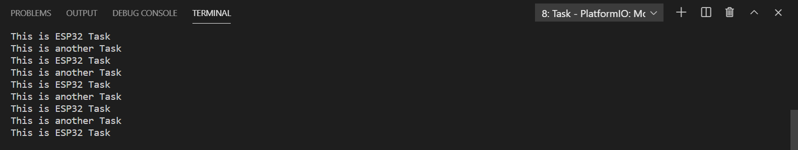

# Práctica 4.1 Sistemas operativos en tiempo real
###### Andrea Muñiz
<p></p>

> _Pregunta 1_: ¿Qué sucede si está utilizando una pantalla de tinta electrónica que tarda unos segundo en actualizarse?

Lo que sucede es que el procesador estará bloqueado hasta que se acabe de realizar la acción que se le haya pedido a la pantalla de tinta electrónica

***

## Programa + explicación

> Declaramos las librerías necesarias

```
#include <Arduino.h>
```

> Función setup()

En esta función inicializamos el Serial a una velocidad de 115200. A continuación inicializamos/creamos la nueva tarea. 
- __anotherTask__: Nombre de la función que queremos que realice.
- __another Task__: Nombre que le damos a la tarea que va a realizar el microcontrolador y los componentes que le hayamos añadido.
- __1000__: Tamaño que creemos/sabemos que va a ocupar la nueva tarea.
- __NULL__: Parámetro que le damos a la tarea en caso de que sea necesario.
- __1__: Número de prioridad que tiene la tarea en caso de que haya otras.
- __NULL__: Controlador de la tarea se que ha creado.

```
void setup(){
  Serial.begin(115200);
  xTaskCreate(anotherTask, "another Task", 10000, NULL, 1, NULL);
}
```

> Función bucle

En este caso la función loop() lo unico que hace es escribir por el monitor _This is ESP32Task_ y esperar un segundo.

```
void loop(){
  Serial.println("This is ESP32 Task");
  delay(1000);
}
```

> Función anotherTask()

Esta función es en la que se implementa la nueva tarea. En este caso se crea un bucle _for_ infinito el cual escribe por pantalla _this is another Task_. Para finalizar la función se utiliza la instrucción _vTaskDelete()_ para que, una vez terminada la tarea, se elimine.

```
void anotherTask(void* parametro){
  for(;;){
    Serial.println("this is another Task");
  }
  vTaskDelete(NULL);
}
```

***

## Salidas de la impresión serie

Si abrimos el monitor serie, veremos que se van escribiendo sucesivamente las frases: _This is ESP32Task_ y _this is another Task_, como se puede observar en la imagen inferior.

